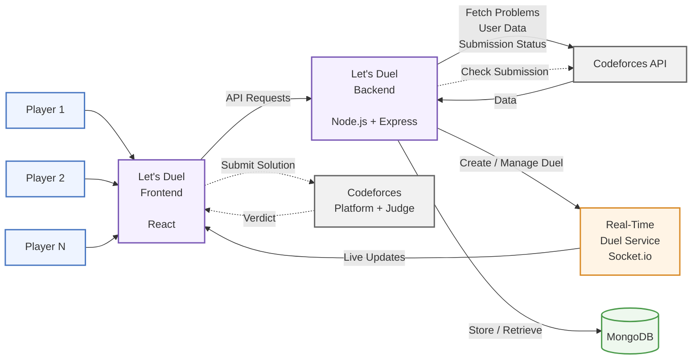

## System Architecture

```mermaid
flowchart LR

    %% Players
    P1[Player 1]
    P2[Player 2]
    PN[Player N]

    %% Main Application
    F[Let's Duel<br/>Frontend<br/><br/>React]

    B[Let's Duel<br/>Backend<br/><br/>Node.js + Express]

    %% External Services
    CFAPI[Codeforces API]
    CF[Codeforces<br/>Platform + Judge]

    %% Backend Services
    WS[Real-Time<br/>Duel Service<br/>Socket.io]
    DB[(MongoDB)]

    %% Player flow
    P1 --> F
    P2 --> F
    PN --> F

    %% Main flow
    F -->|API Requests| B

    %% Codeforces API
    B -->|Fetch Problems<br/>User Data<br/>Submission Status| CFAPI
    CFAPI -->|Data| B

    %% Duel
    B -->|Create / Manage Duel| WS
    WS -->|Live Updates| F

    %% Database
    B -->|Store / Retrieve| DB

    %% Submission
    F -.->|Submit Solution| CF
    CF -.->|Verdict| F

    %% Backend tracks result
    B -.->|Check Submission| CFAPI

    %% Styling
    classDef player fill:#eef4ff,stroke:#4a78c2,stroke-width:2px
    classDef app fill:#f5f0ff,stroke:#7957b5,stroke-width:2px
    classDef service fill:#fff4e5,stroke:#d98b28,stroke-width:2px
    classDef external fill:#f1f1f1,stroke:#666,stroke-width:2px
    classDef database fill:#eef8ee,stroke:#4b9b4b,stroke-width:2px
    class P1,P2,PN player
    class F,B app
    class WS service
    class CFAPI,CF external
    class DB database
```